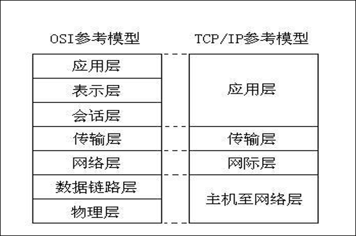
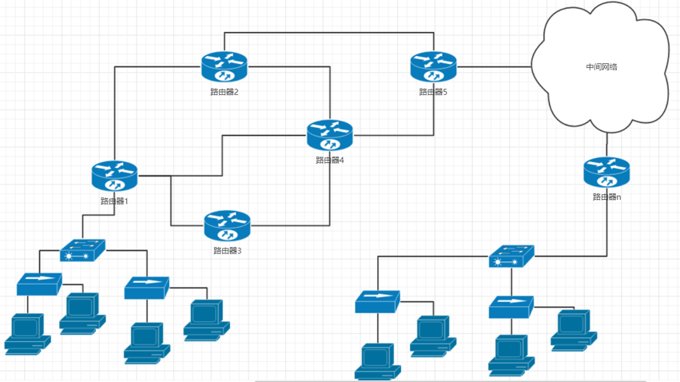

## 网络模型 

网络编程就是用来实现网络互连的不同计算机上运行的程序间可以进行数据交换。  

计算机网络之间以何种规则进行通信，就是网络模型研究问题。

网络模型一般是指：
- OSI（Open System Interconnection开放系统互连）参考模型（理想化模型 理论）

- TCP/IP参考模型（实际的标准）

基本概念：
- IP 地址：计算机在网络中的地址，或者说唯一标识。

- MAC 地址：网卡地址，或者说唯一标识。

- port 端口号：进程在某计算机中的逻辑地址，或者唯一标识。

!> IP + 端口号才能唯一确定要通信的目标地址。

网络参考模型图：  



计算机网络通信过程举例：



## 网络编程三要素

网络编程三要素：IP 地址、端口号以及传输层协议。  
- IP + port = 目标地址。

- 传输层提供了不同类型的传送数据的方式（随协议的不同而不同）。

### IP 地址

IP 地址有两个主要的功能：
- 标识主机。标识其网络接口，并且提供主机在网络中的位置。

- 网络寻址。该功能的目的是将数据报从一个网络模块送到目的地。在发送的整个过程，IP 地址充当着目的地的位置，域名意味着我们要找什么，路由代表着如何到达目的地的这个过程。每个 IP 数据包的标头包含了发送主机的 IP 地址和目的主机的 IP 地址。

常见的 IP 地址分为 IPv4 与 IPv6 两大类，IP 地址由一串数字组成。IPv4 由十进制数字组成，并以点分隔，如：`172.16.254.1`；Pv6 由十六进制数字组成，以冒号分割，如：`2001:db8:0:1234:0:567:8:1`。

InetAddress 类表示互联网协议 (IP) 地址。

```java
public class InetAddress extends Object implements Serializable
```

InetAddress 类没有构造方法，所以不能直接 new 出一个对象。可以通过 InetAddress 类的静态方法获得 InetAddress 的对象。

常见方法：
- `static InetAddress getByName(String host)`：在给定主机名的情况下确定主机的 IP 地址。

- `static InetAddress getLocalHost()`：返回本地主机。  

- `String getHostAddress()`：返回 IP 地址字符串（以文本表现形式）。

- `String getHostName() `：获取此 IP 地址的主机名。

### 端口号

端口号（取值范围 0~65535）只具有本地意义。每个进程都有一个端口号。端口号标识进程的逻辑地址。

网络通信说到底是进程与进程间的通信，因此 `IP + 端口号` 才能构成完整的目标地址。

### 传输层协议

协议：规则的有序集合。

传输层协议：TCP 和 UDP。  
- TCP：传输控制协议，可靠的传输。  
  发送数据前要首先建立连接（3 次握手机制），连接建立成功后，会建立数据传输的通道，然后在该通道下进行数据传输 (一对一的通信) 。

- UDP：数据报协议（1 对多）。  
  发送数据时无需建立连接。  
  每个发送的数据报大小限制在 64KB。  

Socket 套接字 = IP + 端口号。
Socket 本身是网络协议中的概念，和语言无关。Java 类库中，定义了各种 Socket 类（类名都带 Socket），来抽象传输层的功能，供我们的应用程序使用。

对于 TCP 和 UDP 分别定义类不同类型的 Socket 类，来实现分别基于 TCP 和 UDP 协议的输出传输。

## UDP 传输

网络编程的核心意义在于不同的电脑主机之间进行的数据交互，但是在 Java 中将这一概念又进一步进行了简化，即 Java 是以 JVM 进程划分网络的（如果一台电脑运行多个 JVM，那么这些不同的 JVM 彼此都是一台主机）。  

网络编程的实质意义在于数据的交互，而在交互的过程中一定会分为服务器端与客户端，而这两端的开发就会存在以下两种方式。  
- C/S 结构（Client/Server）：一般需要编写两套程序，一套是客户端代码，另一套属于服务器端代码。由于需要有编写程序，所有对开发以及维护的成本比较高。但是由于其使用的是自己的连接端口与交换协议，所有安全性比较高。而 C/S 结构程序的开发分为两种：TCP（传输控制协议，可靠的传输）和 UDP（数据报协议）。  

- B/S 结构（Brower/Server）：不再单独开发客户端代码，只开发一套服务端程序，客户端利用浏览器进行访问，这种模式只需要开发一套程序，但是安全性不高，因为使用的是公共的 HTTP 协议以及公共的 80 端口。  

### UDP 发送端

步骤：  

```mermaid
graph LR
A[建立 UDP 的 Socket 对象] --> B[将要发送的数据封装成数据包] --> C[通过 UDP 的 Socket 对象将数据包发送出去] --> D[释放资源]
```

DatagramSocket 类表示用来发送和接收（数据报包）的套接字。
- DatagramSocket 既可以发送，也可以用来接受数据。

- 发送和接收的数据都是数据报包。

常用方法：  
- `DatagramSocket(int port)`：创建数据报套接字并将其绑定到本地主机上的指定端口。即得到本地主机 IP + port 端口号。  
  该构造方法绑定了本地主机的指定端口，一旦创建好该 Socket 对象之后可以从该端口发送信息，也可以从该端口接收数据。

- `DatagramPacket(byte[] buf, int offset, int length, InetAddress address, int port)`：构造数据报包，用来将长度为 length 偏移量为 offset 的包发送到指定主机上的指定端口号。  
  - buf：包数据，即实际要发送的数据（byte[]）。  
  - offset：包数据偏移量。  
  - length：包数据长度。  
  - address：目的 IP 地址。  
  - port：目的 IP 端口号。  

!> UDP 协议是一种不可靠的无连接的协议：没有接收端，发送端仍然可以发送数据。


### UDP 接收端

步骤：

```mermaid
graph LR
A[建立 UDP 的 Socket 对象] --> B[创建用于接收数据的数据报包通过 Socket 对象的 receive 方法接收数据] --> C[通过数据包对象的功能来完成对接收到数据进行解析] --> D[释放资源]
```

常用方法：  
- `DatagramPacket(byte[] buf, int length)` 创建用于接受数据的数据报包。

- `DatagramPacket(byte[] buf, int offset, int length)` 用来接收长度为 length 的包，在缓冲区中指定了偏移量。

- `public void receive(DatagramPacket p)` 从此套接字接收数据报包。  
  当此方法返回时，DatagramPacket 的缓冲区填充了接收的数据。  
  数据报包也包含发送方的 IP 地址和发送方机器上的端口号。

注：
- 一个常见错误：`java.net.BindException: Address already in use: Cannot bind`。
  同一台计算机汇，一个端口号，只能被一个进程所绑定。

- DatagramSocket 的 receive 方法是一个阻塞方法，当没有数据发送的时候，如果执行到 receive 方法，该方法会阻塞。

### 示例

<!-- tabs:start -->

#### **发送端**


```java
import java.io.IOException;
import java.net.DatagramPacket;
import java.net.DatagramSocket;
import java.net.InetAddress;

public class Sender {
    public static void main(String[] args) throws IOException {
        // 要发送一个字符串数据
        String data = "hello, udp";

        // 建立 UDP 的 Socket 对象
        DatagramSocket sendSocket = new DatagramSocket(9998);

        // 将要发送的数据封装成数据包
        byte[] byteData = data.getBytes();

        InetAddress localHost = InetAddress.getLocalHost();
        DatagramPacket packet = new DatagramPacket(byteData, 0,
                byteData.length, localHost, 9999);

        // 通过 UDP 的 Socket 对象，将数据包发送出
        sendSocket.send(packet);

        // Socket 对象也可以被看作是一种资源
        sendSocket.close();
    }
}
```

#### **接收端**

```java
import java.io.IOException;
import java.net.DatagramPacket;
import java.net.DatagramSocket;

public class Receiver {
    public static void main(String[] args) throws IOException {
        // 创建 DatagramSocket 对象（绑定指定端口，从该端口接收数据）
        DatagramSocket receiveSocket = new DatagramSocket(9999);

        // 创建用于接收数据的数据报包
        byte[] buffer = new byte[1024];
        DatagramPacket receivePacket = new DatagramPacket(buffer, 0, buffer.length);

        // 通过 Socket 对象的 receive 方法接收数据
        // 此方法在接收到数据报前一直阻塞
        receiveSocket.receive(receivePacket);

        // 根据应用程序逻辑，从数据报包中取出接收到的数据，并解析
        byte[] data = receivePacket.getData();
        int offset = receivePacket.getOffset();
        int length = receivePacket.getLength();

        String s = new String(data, offset, length);
        System.out.println("接收来自 " + receivePacket.getAddress() + ":" + receivePacket.getPort()  + " 的数据：" + s);

        // 释放资源
        receiveSocket.close();
    }
}
```

<!-- tabs:end -->


## TCP 传输

java.net 包提供了网络编程有关的开发工具类，在此包中有以下两个 TCP 核心操作类：
- ServerSocket 类：是一个封装的 TCP 协议的操作类，主要工作在服务器端，用户接收客户端请求。

- Socket 类：也是一个封装了 TCP 协议的操作类，每个 Socket 对象都代表一个客户端。  

### TCP 接收端（服务端）

步骤：

```mermaid
graph LR
A[创建 Serversocket 对象在指定端口监听客户端连接请求] --> 
B[收到客户端连接请求后建立 Socket 连接] --> 
C[从 Socket 中根据需要获取输入流或输出流] -->
D[根据需要向流中写入数据或从流中读数据] --> 
E[释放资源]
```

常用方法：
- `ServerSocket(int port)`：创建绑定到特定端口的服务器套接字。

- `Socket accept()`：侦听并接受到此套接字的连接(请求)。此方法在连接传入之前一直阻塞。

注：
1. ServerSocket 仅仅只处理客户端的连接请求，并且其 accept 方法在接收到连接请求之后，会为本次连接创建新的 Socket 对象。

2. 是服务器端的 Socket 对象和客户端的 Socket 对象之间建立连接并传输数据。

常见报错：
- `BindException: Address already in use`：同一个端口号，只能属于一个进程。

### TCP 客户端

步骤：

```mermaid
graph LR
A[建立客户端的 Socket 对象并明确要连接的服务器] --> 
B[根据需要从 Socket 对象中获取输入流或输出流] --> 
C[向流中读取或写入数据] --> 
D[释放资源]
```

常见方法：  
- `Socket()`：实现客户端套接字，连接本机 IP + 一个创建该对象时随机分配的端口号。

- `Socket(String host, int port)`：创建一个流套接字，并将其连接到指定主机上的指定端口号。

- `getInputStream()`：返回此套接字的输入流。

- `shutdownOutput()`：禁用此套接字的输出流。

常见报错：
- `java.net.ConnectException: Connection refused: connect`：在没有服务器端的时候，直接运行客户端。

### 示例

<!-- tabs:start -->

#### **服务端**

```java
import java.io.IOException;
import java.io.InputStream;
import java.net.ServerSocket;
import java.net.Socket;

public class Server {
    public static void main(String[] args) throws IOException {
        // 创建 ServerSocket 对象，在指定端口监听客户端连接请求
        ServerSocket serverSocket = new ServerSocket(10000);

        // 收到客户端连接请求后，建立 Socket 连接
        Socket socket = serverSocket.accept();

        // 在建立好的连接中，通过在服务器端的 Socket 对象中获取流，来进行数据传输
        InputStream inputStream = socket.getInputStream();

        // 在输入流中读取客户端发送的数据
        byte[] buffer = new byte[1024];
        int len = inputStream.read(buffer);

        // 解析接收到的数据
        String s = new String(buffer, 0, len);
        System.out.println(s);

        // 关闭资源, Socket 对象中的流，不用专门关闭，自己会负责关闭它所持有的流
        socket.close();
        serverSocket.close();
    }
}
```

#### **客户端**

```java
import java.io.IOException;
import java.io.OutputStream;
import java.net.InetAddress;
import java.net.Socket;

public class Client {
    public static void main(String[] args) throws IOException {
        // 建立客户端的 Socket 对象，并明确要连接的服务器。
        InetAddress localHost = InetAddress.getLocalHost();
        Socket socket = new Socket(localHost, 10000);

        // 如果要发送数据，那么就从 Socket 对象中获取输出流
        OutputStream outputStream = socket.getOutputStream();

        // 通过输出流，向对端发送数据
        String s = "hello, tcp";

        // 利用输出流的 write 方法传输数据
        outputStream.write(s.getBytes());

        // 关闭资源, Socket 对象中的流不用专门关闭，自己会负责关闭它所持有的流
        socket.close();
    }
}
```

<!-- tabs:end -->