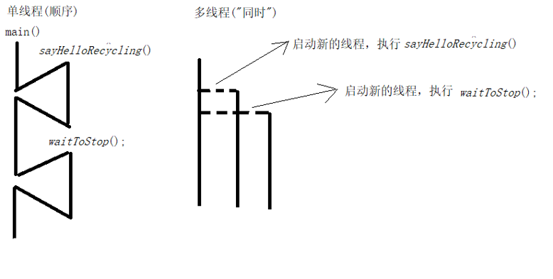
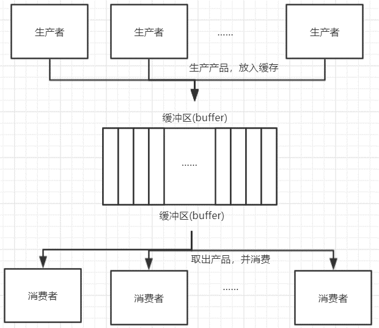
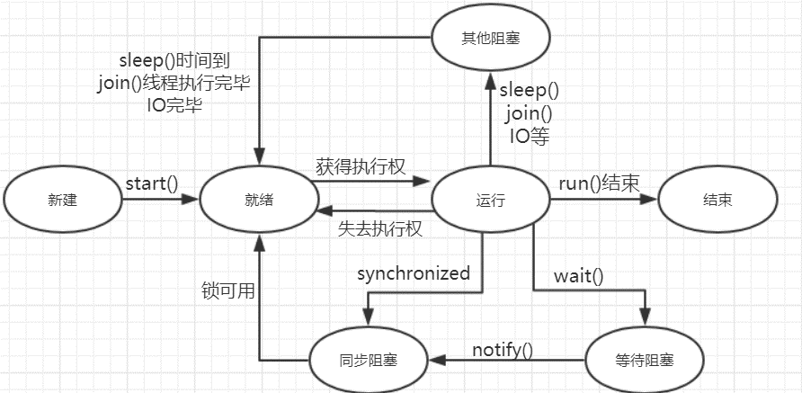

## 进程和线程

进程（process）是指计算机中已运行的程序。  

线程（thread）是操作系统能够进行运算调度的最小单位。大部分情况下，它被包含在进程之中，是进程中的实际运作单位。一条线程指的是进程中一个单一顺序的控制流，一个进程中可以并发多个线程，每条线程并行执行不同的任务。  

多线程是指一个进程在执行过程中可以产生多个线程，这些线程可以同时存在、同时运行。  
多线程是实现并发机制的一种有效手段。

多线程和单线程的执行路径对比：  



Java 命令运行一个程序的过程：  

```mermaid
graph LR
A[启动一个 JVM 进程] --> B[该 JVM 进程在执行的时候首先会创建一个 main 线程] --> C[在 JVM 内存中创建 FileOutputStream 对象]
```

注：
- JVM 天生多线程。

- 多个线程，交替执行。

- 「同时执行」。  
  并发：同一时间段内，同时执行（但是同一时间点，可能并没有同时执行）。  
  并行：同一时间点，同时执行。


## 多线程实现

### 继承 Thread 类

步骤：  

```mermaid
graph LR
A[继承 Thread] --> B[重写子类的 run 方法] --> C[创建该子类的对象] --> D[启动线程]
```

举例：
```java
public class TestDemo {

    public static void main(String[] args) {

        // 创建该子类的对象
        MyThread mt1 = new MyThread("线程 A");
        MyThread mt2 = new MyThread("线程 B");
        MyThread mt3 = new MyThread("线程 C");
        // 启动线程
        mt1.start();
        mt2.start();
        mt3.start();
    }

}

/**
 * 继承 Thread
 */
class MyThread extends Thread {

    private String name;

    public MyThread(String name) {
        this.name = name;
    }

    /**
     * 覆盖 run() 方法，作为线程的主操作方法
     */
    @Override
    public void run() {
        for (int i = 0; i < 3; i++) {
            System.out.println(this.name + " --> " + i);
        }
    }

}

/* 可能的输出结果：
线程 A --> 0
线程 B --> 0
线程 B --> 1
线程 B --> 2
线程 C --> 0
线程 C --> 1
线程 C --> 2
线程 A --> 1
线程 A --> 2
*/
```

注：
- 一个 Thread 类（Thread 子类）对象代表一个线程。

- 必须重写 Thread 类中的 run 方法。只有 run 方法中的代码，才会执行在子线程中。

- 如果想要让代码在子线程中运行，并非一定要把代码写在 run 方法方法体中。  
  对于定义在该 Thread 子类中其他方法方法体中的代码，也可以运行在子线程。即，一个方法被哪个线程中的代码调用，被调用的方法就运行在调用它的线程中。

- 必须使用 `start()` 方法来启动线程，这样才能使 Thread 中的 run 方法运行在子线程中。如果通过调用 run 方法，这仅仅只是普通的方法调用。

- 同一个 Thread 或 Thread 子类对象（代表同一个线程），只能被启动一次。如果想要启动多个线程，只能创建多个线程对象，并启动这些线程对象。

### 实现 Runnable 接口

步骤：  

```mermaid
graph LR
A[实现 Runnable 接口] --> B[实现 Runnable 接口的 run 方法] --> C[创建该子类的对象] --> D[在创建 Thread 对象的时候将创建好的 Runnable 子类对象作为初始化参数传递给 Thread 对象] --> E[启动线程]
```


举例：
```java
public class TestDemo {
    public static void main(String[] args) {

        MyThread mt1 = new MyThread("线程 A");
        MyThread mt2 = new MyThread("线程 B");
        MyThread mt3 = new MyThread("线程 C");

        // 区别
        new Thread(mt1).start();
        new Thread(mt2).start();
        new Thread(mt3).start();
    }
}

class MyThread implements Runnable {
    private String name;

    public MyThread(String name) {
        this.name = name;
    }

    @Override
    public void run() {
        for (int i = 0; i < 3; i++) {
            System.out.println(this.name + " --> " + i);
        }
    }
}

/* 可能的运行结果
线程 A --> 0
线程 B --> 0
线程 C --> 0
线程 B --> 1
线程 A --> 1
线程 A --> 2
线程 B --> 2
线程 C --> 1
线程 C --> 2
*/
```

### 实现方式区别


Runnable 接口子类的 run 方法代码会运行在子线程当中，所以在线程的第二种实现方式中，自己定义子类实现 Runnable 接口的 run 方法。  

!> Runnable 子类对象并不代表线程，它只代表要在线程中执行的任务。

从逻辑上说，第二种实现方式逻辑十分清晰：
1. 线程就是一条执行路径，至于在线程这条执行路径上，究竟执行的是什么样的具体代码，应该和线程本身没有关系的；

2. 线程实现的第二种方式，把线程（Thread 对象代表线程） 和在线程上执行的任务（Ruannable 子类对象） 分开。

两种方式比较：
- 方式一实现步骤较方式二少。

- 方式一的实现方式，存在单重继承的局限性。

- 方式二将线程和任务解耦。

- 方式二便于多线程数据的共享。


## 线程调度和线程优先级

单 CPU 的情况下，线程的两种主要调度模型：  
- 协同式线程调度（Cooperative Thread-Scheduling）：线程的执行时间由线程本身控制，线程把自己的工作执行完之后要主动通知系统，切换到另一个线程上去。  

  优点：实现简单，而且由于线程要把自己的事情做完后才会进行线程切换，所有切换操作对线程自己是可知的。  
  缺点：线程执行时间不可控。

- 抢占式调度（Preemptive Thread-Scheduling）：线程的执行时间由系统来分配，线程的调度不由线程本身决定。在这种情况下，线程的执行时间是系统可控的。  
  
  Java 使用抢占式调度模型。

线程的优先级：
```java
// 返回线程的优先级。
public final int getPriority()                

// 更改线程的优先级。
public final void setPriority(int priority)   
```

多线程的优先级的取值范围：1 <= priority <=10，默认优先级为 5。然而，我们在 Java 语言中设置的线程优先级仅仅只能被看做是一种「建议」，操作系统有它自己的一套线程优先级（静态优先级 + 动态优先级）。所以不要试图利用线程优先级来间接控制线程调度的顺序。  

Java 官方：线程优先级并非完全没有用，我们 Thread 的优先级具有统计意义。总的来说，高优先级的线程占用 CPU 的执行时间多一点，低优先级线程，占用 CPU 执行时间少一点。


## 多线程相关 API

线程名称 API： 
- `final String getName()`：获取线程的名称。 

- `final void setName(String name)`：设置线程的名称。 

- `static Thread currentThread()`：返回对当前正在执行的线程对象的引用。

线程控制 API：
- `static native void sleep(long millis)`：在指定的毫秒数内让当前正在执行的线程休眠（暂停执行）。

- `final void join()`：等待该线程终止。

- `static native void yield()`：暂停当前正在执行的线程对象，并执行其他线程。

- `final void setDaemon(boolean on)`：将该线程标记为守护线程或用户线程。

- `void interrupt()`：中断线程。

## 线程的生命周期  

新建：线程处于刚刚创建的状态。  

就绪：有执行资格，等待 CPU 调度获得执行权。

运行：取得执行权，正在 CPU 上执行。

阻塞：无执行资格，无执行权。

死亡：线程正常或异常终止（run 方法执行完毕），线程对象成为垃圾，等待垃圾回收器回收。

## 锁

多个线程操作同一资源就有可能出现不同步的问题，出现问题的原因：  
- 多线程运行环境（打破不了这个原因）。

- 数据共享（无法打破该条件）。

- 共享数据的非原子操作（可以打破）。  
  原子操作：一组不可分割的操作，这一组操作要么一次全部执行完毕，要么不执行。

### synchronized

想要解决这类问题，就必须使用同步操作。在 Java 中想要实现线程的同步操作，可以使用 synchronized 关键字。synchronized 关键字可以通过以下两种方式进行使用。
- 同步代码块：利用 synchronized 包装的代码块，但是需要指定同步对象（锁对象），一般设置为 this。  
  > 之前讲过 Java 中有 4 种代码块：普通代码块、构造代码块、静态块、同步块。这里的同步代码块即同步块。  

  > Java 中方法的完整定义格式如下：  
  > ```java
  > [public | protected | private] [static] [final] [native] [synchronized] 方法返回值类型 方法名称(参数列表 | 可变参数) [throws 异常, 异常,...] {}
  > ```
- 同步方法：利用 synchronized 定义的方法。


同步代码块示例：  
```java
public class TestDemo {
    public static void main(String[] args) {
        MyThread mt = new MyThread();

        new Thread(mt, "票贩子 A").start();
        new Thread(mt, "票贩子 B").start();
        new Thread(mt, "票贩子 C").start();
    }
}

class MyThread implements Runnable {
    private int ticket = 5;

    @Override
    public void run() {
        while (ticket > 0) {
            // 定义同步代码块
            synchronized (this) {
                if (this.ticket > 0) {
                    try {
                        // 休眠 1 s，模拟延迟
                        Thread.sleep(100);
                    } catch (InterruptedException e) {
                        e.printStackTrace();
                    }

                    System.out.println(Thread.currentThread().getName() + " 卖出第 " + ticket-- + " 张票");
                }
            }
        }
    }
}

/*可能输出的结果：
票贩子 A 卖出第 5 张票
票贩子 C 卖出第 4 张票
票贩子 B 卖出第 3 张票
票贩子 C 卖出第 2 张票
票贩子 A 卖出第 1 张票
*/
```

!> synchronized 代码块中的锁对象，可以是 Java 语言中的任意对象。  
锁对象就充当着锁的角色。所谓的加锁解锁就是设置随对象的标志位，来表示加锁解锁的状态。而 Java 中所有对象内部都存在一个标志位，表示加锁和解锁的状态。  
当加锁线程执行完了同步代码块中的代码（对共享变量的一组操作），在退出同步代码块之前，JVM 自动清理锁对象的标志位，将锁对象变成未上锁状态。  
对于同一个共享变量的每一组操作，如果说要让他们变成原子操作，必须使用同一个锁对象。


同步方法示例：
```java
public class TestDemo {
    public static void main(String[] args) {
        MyThread mt = new MyThread();

        new Thread(mt, "票贩子 A").start();
        new Thread(mt, "票贩子 B").start();
        new Thread(mt, "票贩子 C").start();
    }
}

class MyThread implements Runnable {
    private int ticket = 5;

    @Override
    public void run() {
        while (ticket > 0) {
            // 买票操作
            this.sale();
        }
    }

    // 同步方法
    public synchronized void sale() {
        if (this.ticket > 0) {
            try {
                Thread.sleep(100);
            } catch (InterruptedException e) {
                e.printStackTrace();
            }

            System.out.println(Thread.currentThread().getName() + " 卖出第 " + ticket-- + " 张票");
        }
    }
}

/* 可能出现的结果：
票贩子 A 卖出第 5 张票
票贩子 C 卖出第 4 张票
票贩子 C 卖出第 3 张票
票贩子 C 卖出第 2 张票
票贩子 B 卖出第 1 张票
*/
```

!> 一个线程进入一个对象的 synchronized 方法后，其它线程不能访问此对象的其它方法，因为一个对象操作一个 synchronized 方法只能由一个线程访问。

### Lock 锁  

实现同步代码块，除了使用 synchronized 之外，在 JDK1.5 之后提供了另外的方式 —— Lock 锁机制。  

Lock：表示锁的接口，其实现机制与 synchronized 不同。
- `lock()`。
- `unlock()`。

常用子类：ReentrantLock。

示例：
```java
import java.util.concurrent.locks.Lock;
import java.util.concurrent.locks.ReentrantLock;

public class TestDemo {
    public static void main(String[] args) {
        MyThread mt = new MyThread();

        new Thread(mt, "票贩子 A").start();
        new Thread(mt, "票贩子 B").start();
        new Thread(mt, "票贩子 C").start();
    }

    private static void synchronizedBlock() {
        Object lock = new Object();
        synchronized (lock) {
        }
    }
}

class MyThread implements Runnable {
    private int ticket = 5;
    // 创建锁对象
    private Lock lock = new ReentrantLock();

    @Override
    public void run() {
        while (ticket > 0) {
            try {
                Thread.sleep(100);
            } catch (InterruptedException e) {
                e.printStackTrace();
            }

            // 利用 Lock 锁机制，构造同步代码块
            lock.lock();
            try {
                if (ticket > 0) {
                    System.out.println(Thread.currentThread().getName() + "卖出第 " + ticket-- + " 张票");
                }
            } finally {
                lock.unlock();
            }
        }
    }
}

/* 可能出现的结果：
票贩子 C卖出第 5 张票
票贩子 B卖出第 4 张票
票贩子 A卖出第 3 张票
票贩子 B卖出第 2 张票
票贩子 A卖出第 1 张票
*/
```


### 死锁问题

同步就是指一个线程要等待另外一个线程执行完毕才会继续执行的一种操作形式，虽然在一个程序中，使用同步可以保证资源共享操作的正确性，但是过多的同步也会产生问题。  
例如：张三想要李四的画，李四想要张三的书，那么张三对李四说了：“把你的画给我，我就给你书”，李四也对张三说了：“把你的书给我，我就给你画”，此时张三在等李四的答复，而李四也在等张三的答复，这样下去最终完成不了交换。这就是死锁问题。  

死锁就是指两个以上的线程在执行过程中，因为争夺资源而产生的一种相互等待的现象。

死锁问题的解决：
- 调整获取多把锁的顺序，让所有线程获取多把锁的顺序相同。

- 当锁的获取顺序不能调整的时候，就让一个线程要么一次持有所有的锁，要么一把锁都不持有。  
  如果把一次持有多把锁，当成是一组原子操作，我们就可以重新再定义一把锁，利用这把锁（结合 synchronized）把一次获取多把锁，变成一组原子操作

注：死锁是一种需要回避的代码，并且在多线程的开发中，死锁都是需要通过大量测试后才可以被检查出来的一种程序非法状态。


### 生产者消费者模型



在生产者消费者模型中，生产者不断生产，并将产品放置在缓冲区，然后消费者从此缓存区中取走产品。  
多个生产者和多个消费者各自都是以异步的方式运行，但是在某些情况写，生产者和消费者之间必须保持协作：
- 当缓冲区空的时候，不允许消费者到缓冲区中取数据。

- 当缓冲区满的时候，不允许生产者向缓冲区中放入数据。

- 同时缓冲区中的一个单元，只能放入一个产品。

同时还要注意，因为生产者和消费者都是异步的，但是它们都共享缓冲区。

线程间通信，Java 中主要通过 Object 中的 3 个方法来实现：
- `public final void wait() throws InterruptedException`：线程的等待。

- `public final void notify()`：唤醒第一个等待的线程。

- `public final void notifyAll()`：唤醒全部等待的线程。

阻塞：在哪个线程中调用了 `wait()`，将导致调用 `wait()` 方法的线程处于阻塞状态。`wait()` 方法除了使线程阻塞之外，还发布对此监视器的所有权并等待，直到其他线程通过调用 `notify()` 方法或 `notifyAll()` 方法通知在此对象的监视器上等待的线程醒来。然后该线程将等到重新获得对监视器的所有权后才能继续执行。

唤醒：在其他线程调用此对象的 `notify()` 方法或 `notifyAll()`方法。
  - 前提条件：当前线程必须拥有此对象监视器（当前线程必须持有这个锁对象）。  
  
  - `notify()` 唤醒在此对象监视器上等待的单个线程。如果所有线程都在此对象上等待，则会选择唤醒其中一个线程。选择是任意性的。

  - `notifyAll()` 唤醒在此对象监视器上等待的所有线程。

完整的线程状态转化：  



`Thread.sleep()` 与 `Object.wait()` 对比：
- 所属不同：  
  sleep 定义在 Thread 类，是静态方法。  
  wait 定义在 Object 类，非静态方法。

- 唤醒条件不同：  
  sleep：休眠时间到。  
  wait：在其他线程中，在同一个锁对象上，调用了 notify 或 notifyAll 方法。

- 使用条件不同：  
  sleep 没有任何前提条件。  
  wait 必须当前线程，持有锁对象，锁对象上调用 wait。

- 休眠时，对锁对象的持有不同（最核心的区别）：
  线程因为 sleep 方法而处于阻塞状态的时候，在阻塞的时候不会放弃对锁的持有。
  但是 wait 方法会在阻塞的时候，放弃锁对象持有。

## 线程池

JDK5 提供了 Executors 来产生线程池，有如下方法：  
- `ExecutorService newCachedThreadPool()`：
    1. 创建一个可根据需要创建新线程的线程池，但是在以前构造的线程可用时将重用它们。
    2. 对于执行很多短期异步任务的程序而言，这些线程池通常可提高程序性能。
    3. 如果现有线程没有可用的，则创建一个新线程并添加到池。
    4. 终止并从缓存中移除那些已有 60 秒钟未被使用的线程。

- `ExecutorService newFixedThreadPool(int nThreads)`：
    1. 创建一个可重用固定线程数的线程池，以共享的无界队列方式来运行这些线程
    2. 以共享的无界队列方式来运行这些线程。在任意点，在大多数 nThreads 线程会处于处理任务的活动状态。
    3. 如果在所有线程处于活动状态时提交附加任务，则在有可用线程之前，附加任务将在队列中等待

- `ExecutorService newSingleThreadExecutor()`：
    1. 创建一个使用单个 worker 线程的 Executor；
    2. 以无界队列方式来运行该线程。

对于线程池而言可以向他提交两种类型的异步任务：
- Runnable 子类对象没有返回值。

- Callable。

线程池的使用：ExecutorService(接口)。
- Future<T> submit(Callable<T> task)

- Future<?> submit(Runnable task)

## 定时任务

在实际开发中，我们需要一些任务在如下情况下执行：
- 在指定的时间延迟之后，比如 3s 后执行。

- 在未来某固定的时间点执行。

- 以固定的时间间隔重复执行等等。

这些待执行的任务统统称之为定时任务。我们通过定时器 Timer 来控制定时任务的执行。

Timer：一种工具，线程用其安排以后在后台线程中执行的任务。可安排任务执行一次，或者定期重复执行。  
Timer 用来安排任务执行的时间， 但具体在指定的时间执行的任务是由 TimerTask 对象决定。

常用 API：
- `schedule(TimerTask task, Date time)`：安排在指定的时间执行指定的任务。

- `void schedule(TimerTask task, Date firstTime, long period)`：安排指定的任务在指定的时间开始进行重复的固定延迟执行。（period 毫秒）
      
- `void schedule(TimerTask task, long delay)`：安排在指定延迟后执行指定的任务。

cancel 方法：
- Timer 的 cancel 方法：当前 Timer 中所有的定时任务都会被取消。

- TimerTask 的 cancel 方法：只终止一个 TimerTask 的执行，前提是（他还没有被 Timer 调度执行）。
