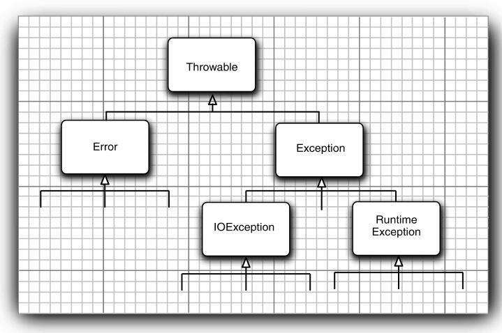

## 默认的异常处理

简单来说，异常就是用来表示 Java 程序运行过程中的错误信息。

用户期望在出现错误时，程序能够采用一些理智的行为。如果由于出现错误而使得某些操作没有完成，程序应该：  
- 返回一种安全状态，并能够让用户执行一些其它的命令。  

- 或者允许用户保存所有操作的结果，并以妥善的方式终止程序。


实际操作中，程序在正常执行的过程中一旦发生错误：  
1. JVM 就会终止程序的运行，转而执行 JVM 的错误处理流程；    

2. 收集错误信息，产生一个描述错误的对象；

3. 访问收集到的错误信息，将错误信息输出到控制台窗口中。

## 异常机制

Java 的理念是尽量把一切错误摒弃在 JVM 之外，最好在程序之前发现程序错误（编译器）。有一部分错误是编译器可以在程序运行前帮我们发现的，但是还有一些错误是 Java 程序不运行，编译器发现不了的。

错误恢复机制（Java 异常处理机制）：Java 语言退而求其次，可以让 Java 程序运行的时候出错，但是同时，Java 语言本身提供了一种通用的错误处理机制 —— 异常处理机制。

异常处理机制：异常的发现和异常的处理（一致性的错误报告模型）。一旦发生错误，就把该错误信息层层向上报告。如果上层知道怎么处理这个错误，上层可以捕获该错误信息并处理。如果上层不知道该怎么处理，可以将错误继续向上报告。

## 异常分类

根据 Java 程序在运行过程中出现的错误的严重程度，异常可分为：  
- Error：系统级别的错误，是 Java 运行环境内部错误或者硬件的问题。它是 JVM 抛出的，不能指望程序来处理。

- Exception：是程序需要捕捉、处理的异常。它是因为程序设计的不完善而出现的，必须由程序来处理。

Java 中的异常层次结构：



在设计 Java 程序时，需要关注 Exception 层次结构。对于 Exception，根据错误处理方式的不同分为两个分支：  
- 运行时异常（Runtime Exception）：由于程序错误导致的异常。是不可预见的，无需显示处理，也可以和编译时异常一样处理。  
  如：错误的类型转换；数组访问越界；访问 null 指针。

- 其它异常：程序本身没有问题，但是由于像 IO 错误这类问题导致的异常。是可预见的，Java 程序必须显示处理，否则程序就会发生错误无法通过编译。  
  如：试图在文件尾部后面读取数据；试图打开一个不存在的文件；试图根据给定的字符串查找 class 对象，而这个字符串表示的类并不存在。

!> “*如果出现 RuntimeException 异常，那么一定是你的问题。*” 是一条相当有道理的规则。


Java 语言规范将派生于 Error 类或 RuntimeException 类的所有异常称为非受检异常（unchecked exception），所有其它的异常称为受检异常（checked exception）。

### 受检异常

对于受检异常来说，如果⼀个⽅法在声明的过程中证明了其要有受检异常抛出：  
```java
public void test() throw new Exception {}
```

那么当我们在程序中调⽤它时，⼀定要对该异常进⾏处理（捕获或者向上抛出），否则是⽆法编译通过的，这是⼀种强制规范。这种异常在 IO 操作中⽐较多，⽐如 FileNotFoundException（当我们使⽤ IO 流处理⼀个⽂件的时候，有⼀种特殊情况，就是⽂件不存在。所以，在⽂件处理的接口定义时它会显⽰抛出 FileNotFoundException，⽬的就是告诉这个⽅法的调⽤者，我这个⽅法不保证⼀定可以成功，是有可能找不到对应的⽂件的，你要明确的对这种情况做特殊处理。）。  
所以说，当我们希望我们的⽅法调⽤者明确地处理⼀些特殊情况的时候，就应该使⽤受检异常。

### ⾮受检异常

对于⾮受检异常来说，⼀般是运⾏时异常，继承⾃ RuntimeException。在编写代码的时不需要显⽰的捕获，但是如果不捕获，在运⾏期如果发⽣异常就会中断程序的执⾏。

这种异常⼀般可以理解为是代码原因导致的。⽐如发⽣空指针、数组越界等。所以，只要代码写的没问题，这些异常都是可以避免的，也就不需要我们显式地进⾏处理。

试想⼀下，如果要对所有可能发⽣空指针的地⽅做异常处理的话，那相当于对所有代码都需要做这件事。

## 异常处理策略

异常的处理策略主要有两种：
- 如果该功能内部可以将问题处理，捕获并处理。

- 如果处理不了则交由调用者处理，向上抛出。

!> 异常一旦被捕获，并且没有再次被抛出，那么上层是感知不到该异常的！


### 异常的捕获

Java 针对异常处理提供了 3 个核心关键字：`try`、`catch` 和 `finally`，利用这 3 个关键字就可以组成异常处理格式。
- try ⽤来指定⼀块预防所有异常的程序。  

- catch ⼦句紧跟在 try 块后⾯，⽤来指定想要捕获的异常的类型。

- finally 确保⼀段代码不管发⽣什么异常状况都要被执⾏。

```java
try {
  // 可能出现异常的语句
} catch(异常类型 对象) {
  // 异常处理
} catch(异常类型 对象) {
  // 异常处理
} …
 finally { // 不管是否出现异常，都执行统一的代码（可省略）
}
```

如果 try 中代码运行时发生了错误，JVM 在发生错误的代码处收集错误信息。try 块中错误代码之后的代码就不会再运行。JVM 会跳转到相应的错误处理器中，执行由开发者自己写的错误处理代码。错误处理器中的代码一旦执行完毕，紧接着程序继续正常执行，执行的是整个 try 代码块之后的代码。  

JDK7 开始引入了一种比较灵活的方式，通过 `|` 运算符，让一个 catch 分支同时处理多种类型的异常。  
示例：
```java
try {

} catch(异常类型 1 | 异常类型 2 | 异常类型 3 ...  e) {
  // 处理异常的代码
}
```

通常所使用的获取异常信息的方法，都定义在 Throwable 类中。 
- `String getMessage()`：获取异常信息，返回字符串。

- `String toString()`：获取异常类名和异常信息，返回字符串。

- `void printStackTrace()`：获取异常类名和异常信息，以及异常出现在程序中的位置，并打印到控制台

- `void printStackTrace(PrintStream s) `：该方法将异常内容保存在日志文件中，以便查阅。 

示例：  
```java
public class TestDemo {

    public static void main(String[] args) {
        try {
            int i = 1;
            int result = i / 0;
        } catch (Exception e) {

            // getMessage()
            String message = e.getMessage();
            System.out.println("异常信息的描述字符串是：" + message);

            // toString()
            String toStirng = e.toString();
            System.out.println("toString(): " + toStirng);

            // printStackTrace()
            e.printStackTrace();
        }
    }

}

/* 运行结果：
异常信息的描述字符串是：/ by zero
toString(): java.lang.ArithmeticException: / by zero
java.lang.ArithmeticException: / by zero
	at com.gyh.test.TestDemo.main(TestDemo.java:7)
*/
```

!> 一次匹配，只会执行多个 catch 分支中的一个。因此在多 catch 分支的情况下，如果不同的 catch 分支处理的异常类型有父子关系，则处理子类的异常分支写在前，父类的异常分支写在后。  

finally 的特点：被 finally 控制的语句体一定会执行。特殊情况：在执行到 finally 之前 JVM 退出了（比如 `System.exit(0)`）。  

finally 的作用：用于释放资源，在 IO 流操作和数据库操作中会见到。

final、finally 和 finalize 的区别：
1. final 修饰类、变量（成员变量和局部变量）和成员方法。  
    - 修饰类之后，该类不能被继承。

    - 修饰变量之后，该变量变成自定义常量。

    - 修饰方法之后，该方法部类被子类覆盖。

2. finally 修饰代码块。对于 try-catch-finnally 代码块而言，finally 代码块中的代码，不管是否发生异常，finally 代码块中的代码，最后都会执行。即使在 finally 代码块之前，有 return 语句，finally 代码块，仍然会执行。特殊情况：在执行到 finally 之前 JVM 退出了（比如System.exit(0)）。
   
3. finalize() 是 Object 类中的一个方法。该方法在对象变成垃圾，并且被垃圾回收期调用之前，JVM 会在该对象上调用 finalize() 方法一次且仅一次。

!> 即使在 finally 代码块之前有 return 语句，finally 代码块仍然会执行。是在 return 「中间」执行。

示例：  
```java
public class TestDemo {

  public static void main(String[] args) {
      int i = testFinally();
      System.out.println("i = " + i);

  }

  public static int testFinally() {
      int i = 10;
      try {
          i = 20;
          i = i / 0;
      } catch (Exception e) {
          i = 30;
          return i;
      } finally {
          System.out.println("finally");
          i = 40;
      }
      i = 50;
      return i;
  }

}

/* 运行结果：
finally
i = 30
*/
```

### 异常的抛出

一个方法必须声明所有可能抛出的受检异常，而非首检异常要么不可控制（Error），要么就应该避免发生（RuntimeException）。  

!> 如果异常被捕获就不用抛出。

在 Java 中，与异常抛出有关的主要有两个关键字：throws 和 throw。  

throws 在方法定义时使用，声明该方法可能抛出的异常。对于编译时异常，可以在语法层面强制方法调用者处理该异常。  

基本语法：
```java
修饰符 返回值(形参列表) throws 异常列表 {}
```
 
注：
- 异常列表之间用逗号分割，列表中出现的异常不要出现包含关系。

- 方法覆盖时，子类异常列表必须与父类兼容。  
  - 当子类方法声明的异常类型和父类声明的异常类型完全相同的时候，才可以发生方法覆盖。  

  - 子类中声明的异常类型，都是父类中声明异常列表中的异常的子类类型（只针对编译时异常）。  

  - 如果父类没有异常列表，子类也不能有异常列表（子类也没有才能发生方法覆盖）。

  - 如果父类有异常列表，子类没有异常列表，可以发生方法覆盖。

- 主方法上不建议使用 throws，因为如果程序出现了错误，也希望其可以正常结束调用。

throw 在方法体中使用，主动在程序中抛出异常，且每次只能抛出确定的某个异常对象。  

基本语法：
```java
throw 异常对象
```

示例：  
```java
public class TestDemo {

    public static void main(String[] args) {
        try {
            testThrow(-1);
        } catch (Exception e) {
            e.printStackTrace();
        }
    }

    /**
     * 定义方法，在该方法体中主动抛出异常对象。
     * 有如下场景：
     *     1. 该方法的合法参数范围是 i > 0；
     *     2. 如果说方法实际运行时，接收到的实际参数值 <= 0 , 此时我们认为参数传递的错误，传递了非法参数。
     * @param i
     * @throws Exception
     */
    public static void testThrow(int i) throws Exception {

        if (i <= 0) {
            // 如果参数值非法，直接抛出异常, 并利用其构造方法，自定义异常描述字符串内容
            throw new Exception("我抛出了编译时异常 " + i);
        }

        // 正常处理逻辑
        System.out.println("after throw");
    }
    
}

/* 运行结果：
java.lang.Exception: 我抛出了编译时异常 -1
	at com.gyh.list.TestDemo.testThrow(TestDemo.java:23)
	at com.gyh.list.TestDemo.main(TestDemo.java:7)
*/
```

!> 若要抛出编译时异常，则必须和 throws 配合起来使用。一旦执行，throw 关键字的语句后面的代码就不会在执行。

throws 和 throw 对比：  

| throws | thorw |  
| :- | :- |  
| 用在方法声明后面，跟的是异常类名。 | 用在方法体内，跟的是异常对象名。 |  
| 可以跟多个异常类名，用逗号隔开。 | 只能抛出一个异常对象。 |  
| 表示抛出异常，由该方法的调用者来处理。 | 表示抛出异常，可以由方法体内的语句处理。 |  
| 表示出现异常的一种可能性，并不一定会发生这些异常。 | 执行 throw 则一定抛出了某种异常。 |  

## 自定义异常  

Java 本身已经提供了大量的异常，但这些异常在日常生活的工作中往往并不够使用，这时就需要 coder 自己去定义一个异常类。  

自定义异常分两种：  
- 继承自 Exception（强制性异常处理）。

- 继承自 RuntimeException（选择性异常处理）。

自定义异常的意义：仅仅在于异常的处理。

示例：  
```java
public class TestDemo {

    public static void main(String[] args) {
        try {
            recordScore(-1);
        } catch (MyRuntimeException e) {
            e.printStackTrace();
        }
    }

    public static void recordScore(int score) {
        if (score < 0 || score > 100) {
            throw new MyRuntimeException("MyRuntimeException 分数异常：" + score);
        }
    }

}

// 自定义的运行时异常
class MyRuntimeException extends RuntimeException {
    
    public MyRuntimeException(String msg) {
        super(msg);
    }

}

/* 运行结果：
com.gyh.MyRuntimeException: MyRuntimeException 分数异常：-1
	at com.gyh.TestDemo.recordScore(TestDemo.java:15)
	at com.gyh.TestDemo.main(TestDemo.java:7)
*/
```

## 断言

断言（Assertion）是一种调试程序的方式。断言机制允许在测试期间向代码中插入一些检查语句。当代码发布时，这些插入的检查语句会自动清掉。

!> 默认情况下，断言被禁用。可以在运行程序时用 `-enableassertions` 或 `-ea` 选项启用。断言被禁用时，类加载器将跳过断言代码，因此不会降低程序运行的速度。

在 Java 中，使用 `assert` 关键字来实现断言。这个关键字有两种形式：
```java
assert 条件;
```
和
```java
assert 条件 : 表达式;
```

断言失败时会抛出 AssertionError，导致程序结束退出。因此断言不能用于可恢复的程序错误，只应该用于开发和测试阶段。

示例：
```java
public class TestDemo {

    public static void main(String[] args) {

        int x = -1;
        assert x > 0 : "x must < 0";

        System.out.println("after");
    }

}

/* 运行结果：
Exception in thread "main" java.lang.AssertionError: x must < 0
	at com.gyh.TestDemo.main(TestDemo.java:8)
*/
```

## JDK Logging

在编写程序的过程中，常常使用 `System.out.println()` 观察执行过程，然后有针对性地修改代码，发现问题后再将其删去。这样增加删除十分麻烦，使用日志能很好解决这个问题。

日志的优点：
- 可以很容易地取消全部日志记录，或者仅仅取消某个级别的日志。

- 日志记录可以被定向到不同的处理器，用于在控制台中显示，用于存储在文件中等。日志记录器和处理器都可以对记录进行过滤。过滤器可以根据过滤实现器制定的标准丢弃那些无用的记录项。

- 日志记录可以采用不同的方式格式化，例如，纯文本或XML。

Java 标准库内置了日志包 java.util.logging 可以直接使用。

JDK 的 Logging 定义了7个日志级别，从严重到普通：
- SEVERE
- WARNING
- INFO
- CONFIG
- FINE
- FINER
- FINEST

默认级别是 INFO。使用日志级别的好处在于，调整级别就可以屏蔽掉很多调试相关的日志输出。

示例：
```java
import java.util.logging.Logger;

public class TestDemo {

    public static void main(String[] args) {

        Logger logger = Logger.getGlobal();

        logger.severe("SEVERE");
        logger.warning("WARNING");
        logger.info("INFO");
        logger.config("CONFIG");
        logger.fine("FINE");
        logger.finer("FINER");
        logger.finest("FINEST");

    }
    
}

/* 运行结果：
五月 12, 2021 12:51:12 上午 com.gyh.TestDemo main
严重: SEVERE
五月 12, 2021 12:51:12 上午 com.gyh.TestDemo main
警告: WARNING
五月 12, 2021 12:51:12 上午 com.gyh.TestDemo main
信息: INFO
*/
```

内置的 Logging 缺点：
- Logging 系统在 JVM 启动时读取配置文件并完成初始化，一旦开始运行 main() 方法，就无法修改配置。

- 配置不太方便，需要在 JVM 启动时传递参数 `-Djava.util.logging.config.file=<config-file-name>`。