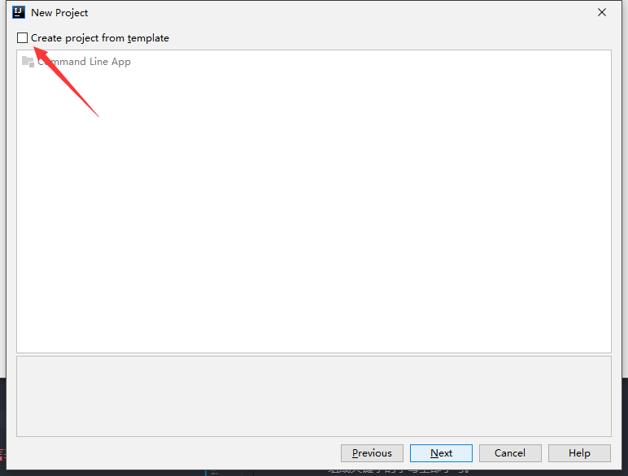
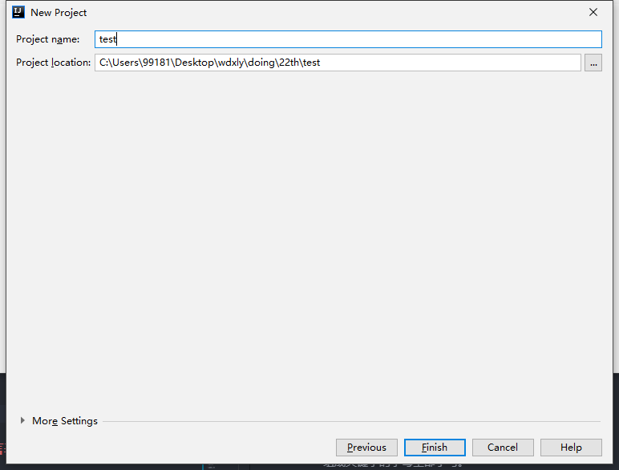
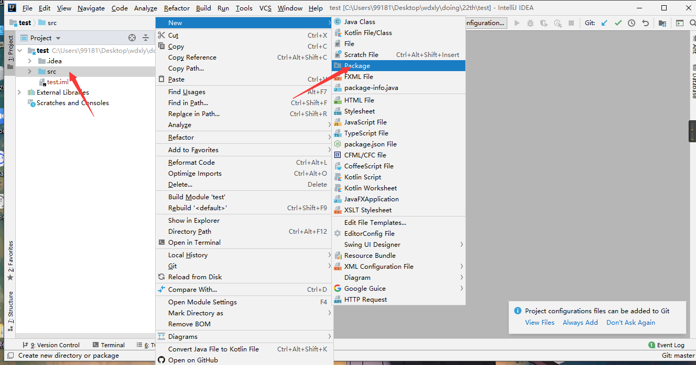
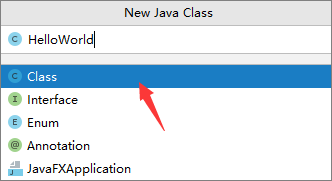
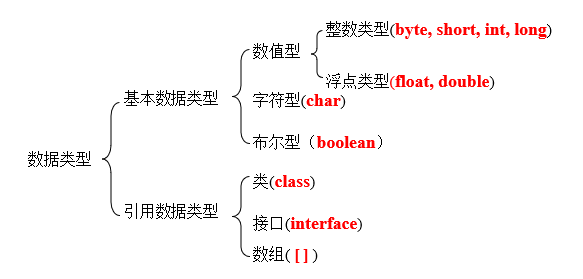

# week1

本周学习任务：  
- Java 语言介绍，JDK 的介绍，Java 开发环境配置
- 基本语法，包括关键字、标识符、常量、进制转换、数据类型、运算符、流程控制语句
- 一维数组，二维数组，多维数组
- 方法，方法重载，多态的引入
- 面向对象，类的初始化及变量作用域，类的访问控制权限，面向对象三大特性（封装、继承、多态）

## 目录

- [Java语言概述](#Java语言概述)  
  - [JAVA语言的诞生](#JAVA语言的诞生)
  - [JAVA语言的平台版本](#JAVA语言的平台版本)
  - [JAVA语言的特点](#JAVA语言的特点)
  - [JDK与JRE](#JDK与JRE)
  - [JDK的下载和安装](#JDK的下载和安装)
  - [JAVA程序运行原理](#JAVA程序运行原理)
  - [PATH和CLASSPATH环境变量](#PATH和CLASSPATH环境变量)

- [HelloWorld](#HelloWorld)  
  - [命令行](#命令行)  
  - [IDEA](#IDEA)

- [Java语言基础](#Java语言基础)  
  - [关键字](#关键字)
  - [标识符](#标识符)
  - [注释](#注释)
  - [常量](#常量)
  - [原码反码补码](#原码反码补码)
  - [变量](#变量)


## Java语言概述

### JAVA语言的诞生

Java 是由 Sun 公司于 1995 年 5 月推出的 Java 面向对象程序设计语言和 Java 平台的总称。由 James Gosling 和同事们共同研发，并在 1995 年正式推出。  

### JAVA语言的发展

- JDK 1.0 (1996.1)
- JDK 1.1 (1997.2)
- J2SE 1.2 (1998.12) 
- J2SE 1.3 (2001.9)
- J2SE 1.4 (2002.2) 
- J2SE 5.0 (2004.9) 
- Java SE 6 (2006.12) 
- Java SE 7 (2011.7) 
- Java SE 8 (2014.3) 
- Java SE 9 (2017.9)
- Java SE 10 (2018.3)
- Java SE 11 (2018.9)
- Java SE 12 (2019.3)
- Java SE 13 (2019.9)
- Java SE 14 (2020.3)

### JAVA语言的平台版本

- Java SE 标准版。  
  是为开发普通桌面和商务应用程序提供的解决方案  

- Java ME 嵌入式开发  
  是为开发电子消费产品和嵌入式设备提供的解决方案  

- Java EE 企业级开发  
  是为开发企业环境下的应用程序提供的一套解决方案  

注：Java SE 为整个技术架构的核心。  

### JAVA语言的特点

- **跨平台**  
  Java 程序是在 Java 虚拟机上运行，而非直接运行于操作系统。因此通过 Java 语言编写的应用程序在不同的系统平台上都可以运行。  
    

- 面向对象  

- 解释型  
  编译型语言写出的代码，首先通过编译器的编译，全部转化成目标代码，然后依次在操作系统中执行。解释型语言则是转化一句，执行一句。  
  Java 编译过程：.java -> .class -> Java 虚拟机。  

- 健壮  
  提供了异常机制。  

- 动态  
  两个方面  
  1. 在 Java 语言中，可以简单、直观地查询运行时的信息。  
  2. 可以将新代码加入到一个正在运行的程序中。  

- 分布式  
  Java 语言具有强大的、易于使用的联网能力。

- 高效  
  由于 Java 是一种解释型语言，所以它的执行效率相对就会慢一些，但由于 Java 语言采用以下两种手段，使其拥有较好的性能。  
  1. Java 语言源程序编写完成后，先使用 Java 伪编译器进行伪编译，将其转换为中间码，再解释。  
  2. Java 语言提供一种「准实时」（Just-in-Time，JIT）编译器，当需要更快速度时，Java 语言可以使用 JIT 编译器将字节码转换成机器码，然后将其缓冲下来，这样速度就会更快。

- 多线程

- 结构中立（字节码）  
  Java 编译器通过伪编译后，将生成一个与任何计算机体系统无关的「中性」的字节码。  

- **开源**

### JDK与JRE

- JRE(JAVA  Runtime Environment)  
  包括 Java 虚拟机、运行时核心类库（rt.jar）。JRE 主要是给已经写好的 Java 程序使用，换句话说 Java 程序要能在操作系统中运行，必须有 JRE。

- JDK(JAVA  Develop kit)  
  首先，JDK 包含 JRE，除此之外，JDK 中还包含一些供开发者使用的工具，比如 Javac、Javap 等。

### JDK的下载和安装

JDK8 下载地址：https://www.oracle.com/java/technologies/javase-jdk8-downloads.html 。  
建议 JDK 安装路径中不要有中文，同时当提示安装 JRE 时，可以选择不安装。

### JAVA程序运行原理

  

### PATH和CLASSPATH环境变量

PATH 环境变量是操作系统的环境属性，告诉操作系统可执行程序（javac）路径。  
官方推荐的配置 PATH 环境变量方式：  
1. JAVA_HOME 环境变量：xx\xx\xx\jdk1.8  
2. 配置 PATH 环境变量：$JAVA_HOME$\bin

CLASSPATH 环境变量是所有 *.class 文件的执行路径，给 JVM 用，告诉 JVM 到哪里加载 *.class 文件。  

## HelloWorld

### 命令行

创建 HelloWorld.java 文件，用文本编辑器打开编辑：  
```java
public class HelloWorld {
	public static void main(String[] args) {
		System.out.println("Hello World!");
	}
}  
```  
打开 cmd，进入 HelloWorld.java 文件所在的文件夹，通过 javac 命令处理 HelloWorld.java 文件后，会生成 HelloWorld.class 文件，接着用 java 命令执行 HelloWorld.class 文件即可（省略 .class 后缀）。  
  

注：如代码中包含中文，javac 命令处理时需要添加 `-enconding UTF-8` 。如：`javac -encoding UTF-8 HelloWorld.java`。

### IDEA

IDEA 官网地址：https://www.jetbrains.com/idea 。  

安装完成后，打开 IDEA，选择新建项目：  
  

选择创建 Java 项目，并选择 JDK 版本：  
  

不勾选：  
  

设置项目名称和存储位置：  
  

Java 代码一般存放在 src 目录下，在此新建一个包：  
  
  

在包文件夹下新建 Java 程序：  
  
  

写好代码后，右击侧边小三角，选择运行，即可在下方显示运行结果：  
  
  


## Java语言基础

### 关键字  

关键字也称保留字，是被 Java 语言赋予特殊含义的单词。  

关键字的特点：
- 组成关键字的字母全部小写。  

关键字的注意事项：  
- 高级的编辑器或者专门的开发工具中，关键字会有高亮效果。
- goto 和 const 作为保留字存在，目前并不使用。

### 标识符

标识符是我们给类、接口、方法、变量等起名字时使用的字符序列。  

组成规则：  
- 英文大小写字母
- 数字字符
- $ 和 _  

注意事项：  
- 不能以数字开头
- 不能是Java中的关键字（保留字）
- 区分大小写

常见命名规则：  
- 包命名  
  单级：一个全部小写的单词  
  多级：以域名反转的方式来命名，单词全部小写，单词以 `.` 隔开。

- 类和接口命名  
  类名使用 UpperCamelCase 风格，但以下情形例外：  
  DO / BO / DTO / VO / AO / PO / UID 等。

- 变量和方法的命名  
  方法名、参数名、成员变量、局部变量都统一使用 lowerCamelCase 风格，必须遵从驼峰形式。

- 常量的命名  
  常量命名全部大写，单词间用下划线隔开，力求语义表达完整清楚，不要嫌名字长。 

注：Java 语言还有很多约定俗成的书写规范。如：  
- 代码中的命名均不能以下划线或美元符号开始，也不能以下划线或美元符号结束。  

- 代码中的命名严禁使用拼音与英文混合的方式，更不允许直接使用中文的方式。  
  说明：正确的英文拼写和语法可以让阅读者易于理解，避免歧义。注意，纯拼音命名方式更要避免采用。  

- 更多规则可以阅读 《阿里巴巴Java开发手册》  

### 注释

注释是指用于解释说明的文字，有助于阅读代码和项目维护。  

Java 语言的注释分类：  
- 单行注释。格式：  
  ```java
  // 这是单行注释
  ```  

- 多行注释。格式：  
  ```java
  /*
  一行
  两行
  可以很多行
  */
  ```  
  注：多行注释不能嵌套使用！

- 文档注释。格式：  
  ```java
  /**
  文档注释内容
  */
  ```

### 常量

常量是指在运行过程中，其值不会发生改变的量。

常量的分类：  
- 字面值常量  

- 自定义常量（面向对象部分讲）  

字面值常量分类  
- 字符串常量  
  用双引号引起来的内容，如："wangdao"。  

- 整形常量  
  所有整数。  
  
- 小数常量  
  所有小数。  

- 字符常量  
  用单引号引起来的内容，如：'a'，'我'。  

- 布尔常量  
  只有 true 和 false。  

- 空常量  
  只有 null。  

JAVA 中的整数型常量的表现形式：  
- 二进制  
  由 0 和 1 组成，以 `0b` 开头，比如 0b1100。

- 八进制  
  由 0~7 组成，以 `0` 开头，比如 014。

- 十进制  
  由 0~9 组成，默认 10 进制，比如 12。

- 十六进制  
  由 0~9，A~F(或 a~f) 表示 0~15，以 `0x` 开头。  

转换方式可以查看 <a href="https://github.com/guo-yaohua/wdxly/blob/master/before/查阅并梳理知识点.md">查阅并梳理知识点</a> -> 计算机体系结构及组成原理 -> Q3 进制转换  

### 原码反码补码  

一个数在计算机中的二进制表示形式， 叫做这个数的机器数。   
- 原码表示法在数值前面增加了一位符号位（即最高位为符号位），正数该位为 0，负数该位为 1，其余位表示数值的大小。

- 反码的表示方法是：正数的反码是其本身；负数的反码是在其原码的基础上，符号位不变度，其余各个位取反。  

- 补码的表示方法是：正数的补码就是其本身；负数的补码是在其原码的基础上，符号位不变，其余各位取反，最后 +1（即在反码的基础上 +1）。

### 变量

变量指在程序运行期间，其值在某个范围内可以改变的量。  
理解（通过名字访问到）变量就是「一片」内存空间。  

变量定义的格式：`数据类型 变量名 = 变量值`。  

一种数据类型，表示的就是一个数据集和基于该数据集的一组合法操作。  
  
不同类型在内存中的存储大小也不同：  
| 类型 | byte | bit|
| --- | --- | --- |
| byte | 8 | 1 |
| char | 16 | 2 |
| short | 16| 2 |
| int | 32 | 4 |
| float | 32 | 4 |
| long | 64 | 8 |
| double | 64 | 8 |
| boolean | ~ | ~ |  

注：boolean 只有两个值：true、false，可以使用 1 bit 来存储，但是具体大小没有明确规定。JVM 会在编译时期将 boolean 类型的数据转换为 int，使用 1 来表示 true，0 表示 false。JVM 支持 boolean 数组，但是是通过读写 byte 数组来实现的。

一些数据类型之间可以互相转换（JVM 默认类型转化规则）：  
- boolean 类型的值不能直接转化为其它数据类型的值
- byte，short，char -> int -> long -> float -> double
- byte，short，char 相互之间不转换，他们参与运算时都会提升为 int 类型。

强制转化目标类型格式：`变量名 = (目标类型)(被转换的数据)`。  

使用变量的注意事项：  
- 作用域  
  变量有效的时间范围，这个范围通常用 `{}` 来界定。 

- 初始化值  
  变量在使用之前，由编译器强制必须赋初值。

- 建议一行定义一个变量  
  从代码的可读性角度来考虑。
